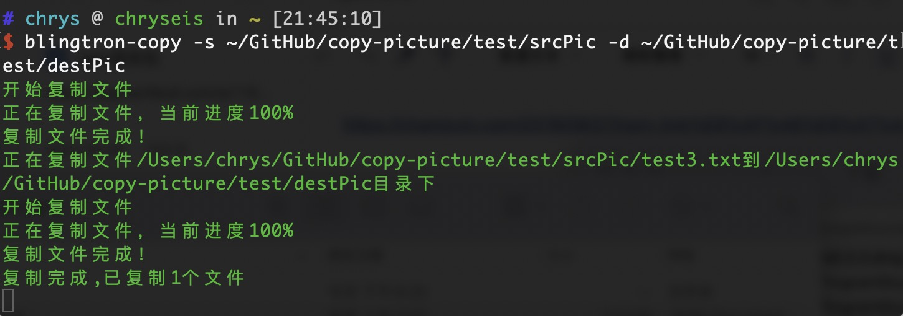

# @blingtron3000-copy

## Install

```bash 
npm i @blingtron3000/copy-files -g
```

## Usage

```bash
  // cmd
 blingtron copy -s /test/src -d /test/dest
 // windows services
 blingtron install -s /test/src -d /test/dest
```



## Options
+ -s, --source，复制目录路径
+ -d, --dest,复制到目录路径
